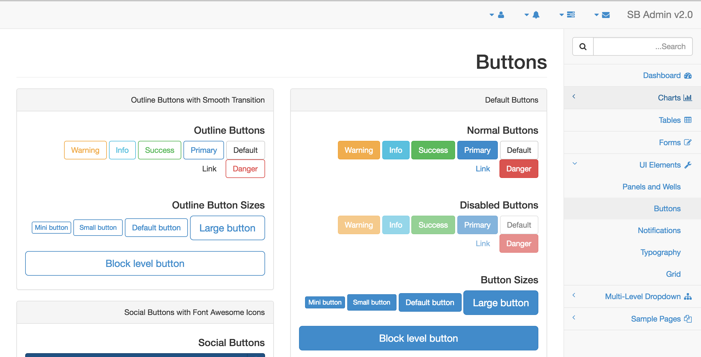
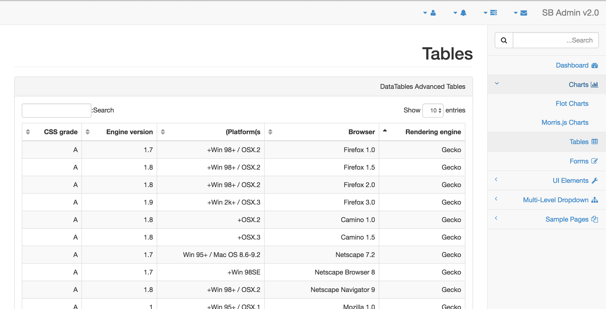

# SB-Admin2-RTL

## About

sb-admin2-rtl is a RTL version of the Bootstrap based admin theme SB Admin 2. Originally created by Start Bootstrap, all the credits of the development of the Bootstrap admin theme are of them. This is just and RTL adaptation.

You could check the original Bootstrap admin theme repository [here](https://github.com/BlackrockDigital/startbootstrap-sb-admin-2). And an online functional demo [here](http://dreamingechoes.github.io/sb-admin2-rtl/demo/index.html).

## Contributing

Bug reports and pull requests are welcome on GitHub at https://github.com/dreamingechoes/sb-admin2-rtl. This project is intended to be a safe, welcoming space for collaboration, and contributors are expected to adhere to the [Contributor Covenant](contributor-covenant.org) code of conduct.

## License

The theme is available as open source under the terms of the [MIT License](http://opensource.org/licenses/MIT).
